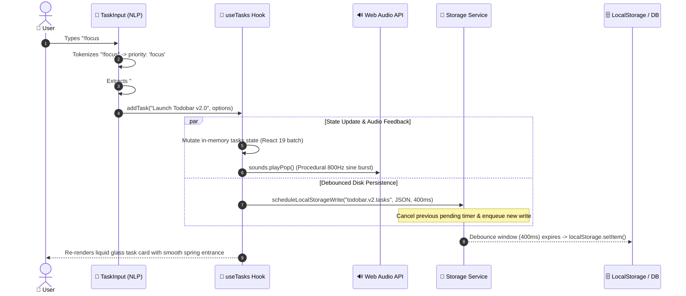
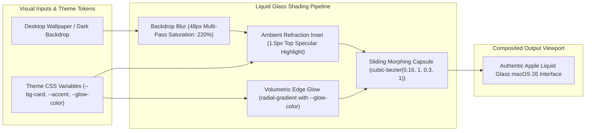
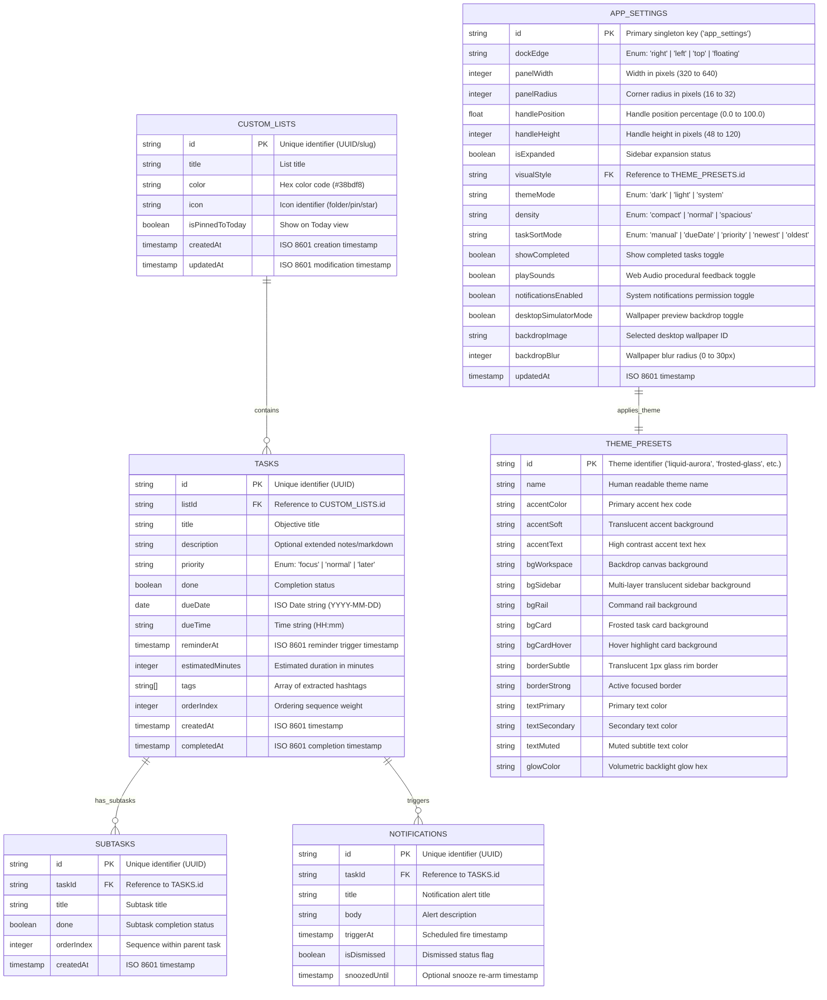
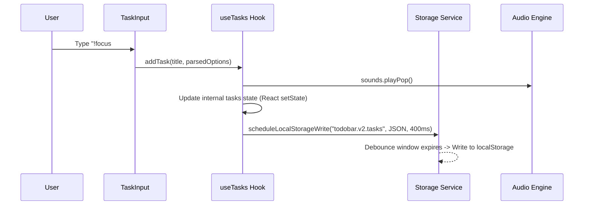

# 🏛️ Architecture & Technical Documentation — Todobar Pro

> **Todobar Pro** is a high-performance, dockable desktop productivity application crafted with **Apple's 2026 Liquid Glass Design System** (macOS 26 Tahoe / iPadOS 26 / VisionOS HIG), React 19, TypeScript, and Tailwind CSS v4.

---

## 📑 Table of Contents

1. [🏗️ System Architecture (Graphify)](#1-️-system-architecture-graphify)
2. [Component & Directory Hierarchy](#2-component--directory-hierarchy)
3. [Liquid Glass Material & Physics Engine](#3-liquid-glass-material--physics-engine)
4. [🗄️ Database Schema & ERD](#4-️-database-schema--erd)
5. [State Management & Reactive Data Flow](#5-state-management--reactive-data-flow)
6. [Storage & Debounced Persistence Engine](#6-storage--debounced-persistence-engine)
7. [Web Audio Procedural Synthesis Engine](#7-web-audio-procedural-synthesis-engine)
8. [Smart Natural Language Processing (NLP)](#8-smart-natural-language-processing-nlp)
9. [Keyboard Navigation & Shortcuts Matrix](#9-keyboard-navigation--shortcuts-matrix)
10. [Desktop & Packaging Pipeline](#10-desktop--packaging-pipeline)

---

## 1. 🏗️ System Architecture (Graphify)

Todobar Pro is structured as a modular, reactive, single-page desktop application designed to run either in modern web browsers or as a lightweight native desktop binary via Tauri / Electron.

### 1.1 Multi-Tier System Topology

```mermaid
graph TB
    subgraph Client_Presentation_Layer ["🖥️ Presentation Layer (Apple 2026 Liquid Glass UI)"]
        EdgeHandle["EdgeHandle (Spring Dock Tab)"]
        MacTitleBar["MacTitleBar (Traffic Lights + Search)"]
        CommandRail["CommandRail (Sliding Glass Capsule)"]
        
        subgraph ViewRouter ["View Router & Subsystems"]
            TodayView["TodayView (Daily Objectives)"]
            CalendarView["CalendarView (Agenda Grid)"]
            ListsView["ListsView (Project Collections)"]
            FocusTimerView["FocusTimerView (Pomodoro Dial)"]
            SettingsView["SettingsView (Preferences & Themes)"]
        end
        
        subgraph Modals_And_Overlays ["Overlays & Daemons"]
            SearchModal["SearchModal (Spotlight Search)"]
            ReminderToasts["ReminderToastContainer (Alarms)"]
            DesktopSim["DesktopSimulator (Wallpaper Backdrop)"]
        end
    end

    subgraph Controller_And_State_Layer ["🧠 Business Logic & State Layer"]
        useTasks["useTasks Hook (Task/List State Engine)"]
        useSettings["useSettings Hook (User Config & Dock Position)"]
        useReminders["useReminders Hook (Polling Notification Daemon)"]
        useShortcuts["useKeyboardShortcuts Hook (Global Hotkey Dispatcher)"]
        NLPEngine["NLP Tokenizer & Natural Language Parser"]
    end

    subgraph Service_And_Driver_Layer ["⚙️ Service & Hardware Abstraction Layer"]
        StorageEngine["storage.ts (Debounced I/O & Memory Cache)"]
        AudioEngine["audio.ts (Web Audio API Synthesizer)"]
        ExportImport["exportImport.ts (JSON Backup & Schema Migrations)"]
    end

    subgraph Host_Persistence_Layer ["💾 Persistence & Operating System Layer"]
        LocalStorage[("HTML5 LocalStorage (Key-Value Store)")]
        SQLite[("Embedded SQLite / Tauri IPC (Native Mode)")]
        SystemNotifications["OS Notification API / Web Audio Output"]
    end

    %% Event Connections
    EdgeHandle -->|Pointer Drag / Toggle| useSettings
    CommandRail -->|View Selection| useSettings
    MacTitleBar -->|Search Query| SearchModal
    
    TodayView -->|Capture Task| NLPEngine
    NLPEngine -->|Structured Data| useTasks
    TodayView -->|Task Mutations| useTasks
    CalendarView -->|Schedule Events| useTasks
    ListsView -->|Project CRUD| useTasks
    FocusTimerView -->|Complete Task| useTasks

    useTasks -->|Trigger Haptic Audio| AudioEngine
    useTasks -->|Queue JSON Mutation| StorageEngine
    useReminders -->|Poll Due Dates| useTasks
    useReminders -->|Dispatch Toast / Sound| AudioEngine
    useReminders -->|Trigger System Alarm| SystemNotifications

    StorageEngine -->|Flush Debounced Writes| LocalStorage
    StorageEngine -.->|Sync Native State| SQLite
    AudioEngine -->|AudioContext Nodes| SystemNotifications
```



---

### 1.2 Reactive Event Pipeline



---

### 1.3 Liquid Glass Shading & Optical Compositing Graph



---

## 2. Component & Directory Hierarchy

```
todobar-app/
├── public/                     # Static assets and favicons
├── src/
│   ├── components/             # Liquid Glass UI Component Layer
│   │   ├── CalendarView.tsx    # Month grid & agenda planner
│   │   ├── CommandRail.tsx     # Sliding liquid glass capsule navigation rail
│   │   ├── DesktopSimulator.tsx# Realistic desktop wallpaper & window simulator
│   │   ├── EdgeHandle.tsx      # Draggable liquid glass edge dock handle
│   │   ├── FocusTimerView.tsx  # Circular SVG progress dial Pomodoro chamber
│   │   ├── LiquidGlassIcon.tsx # 3D refractive liquid glass icon glyph tiles
│   │   ├── ListsView.tsx       # Custom project collections with color tints
│   │   ├── MacTitleBar.tsx     # Native macOS traffic lights & search pill
│   │   ├── ReminderToastContainer.tsx # Sliding notification toasts
│   │   ├── SearchModal.tsx     # Spotlight global search overlay
│   │   ├── SettingsView.tsx    # Appearance, audio, density, backup controls
│   │   ├── TaskInput.tsx       # Quick capture bar with smart tag chips
│   │   ├── TaskItem.tsx        # Unified 3D liquid glass task item cards
│   │   └── TodayView.tsx       # Daily task hierarchy & segmented control
│   ├── constants/
│   │   └── themes.ts           # 12 Curated Liquid Glass theme presets
│   ├── hooks/
│   │   ├── useKeyboardShortcuts.ts # Hotkeys manager (Alt+T, ⌘1-4, /, N)
│   │   ├── useReminders.ts     # Active reminder polling daemon
│   │   ├── useSettings.ts      # User preferences and dock edge state
│   │   └── useTasks.ts         # Task and list CRUD mutations with debounced save
│   ├── services/
│   │   ├── audio.ts            # Native Web Audio API procedural sound engine
│   │   ├── exportImport.ts     # JSON data export, backup, and restore
│   │   └── storage.ts          # Safe localStorage read/write with debouncing
│   ├── types/
│   │   └── index.ts            # TypeScript interfaces & domain models
│   ├── App.tsx                 # Root application container & theme injection
│   ├── index.css               # Tailwind CSS v4 + Liquid Glass shader tokens
│   └── main.tsx                # React 19 root bootstrap
├── ARCHITECTURE.md             # This document
├── README.md                   # Project overview & quick start
├── package.json                # Dependencies & scripts
└── tsconfig.json               # TypeScript strict configuration
```

---

## 3. Liquid Glass Material & Physics Engine

Todobar Pro implements Apple's **macOS 26 / VisionOS Material Specification**:

### 3.1 Refraction & Blur Shader Stack (`src/index.css`)
```css
/* Liquid Glass Material Classes */
.liquid-glass-sidebar {
  background: var(--bg-sidebar) !important;
  backdrop-filter: blur(48px) saturate(220%) contrast(106%) !important;
  border: 1px solid var(--border-subtle) !important;
  box-shadow: 
    inset 0 1.5px 1px 0 rgba(255, 255, 255, 0.35),
    inset 0 0 0 1px rgba(255, 255, 255, 0.08),
    inset 0 -1px 1px 0 rgba(0, 0, 0, 0.2),
    0 30px 70px -15px rgba(0, 0, 0, 0.6),
    0 0 40px 0 var(--glow-color) !important;
}

.liquid-glass-card {
  background: var(--bg-card) !important;
  backdrop-filter: blur(28px) saturate(190%) !important;
  border: 1px solid var(--border-subtle) !important;
  box-shadow: 
    inset 0 1px 1px 0 rgba(255, 255, 255, 0.25),
    0 8px 24px -4px rgba(0, 0, 0, 0.35) !important;
  transition: all 220ms cubic-bezier(0.16, 1, 0.3, 1);
}
```

### 3.2 Spring Physics Curve
Every translation and morphing element (sidebar edge slide, navigation capsule glide, segmented picker highlight) uses Apple's native spring timing curve:
$$\text{cubic-bezier}(0.16, 1.0, 0.3, 1.0) \quad (\text{Duration: } 360\text{ms})$$

---

## 4. 🗄️ Database Schema & ERD

Todobar Pro uses an offline-first, normalized relational data model mapped to debounced JSON key-value persistence in browser environments and native SQLite tables in desktop/Tauri environments.

### 4.1 Entity Relationship Diagram (ERD)



---

### 4.2 SQL DDL Schema (SQLite / PostgreSQL Compatibility)

```sql
-- Custom Project Lists Table
CREATE TABLE custom_lists (
    id TEXT PRIMARY KEY,
    title TEXT NOT NULL,
    color TEXT NOT NULL DEFAULT '#38bdf8',
    icon TEXT NOT NULL DEFAULT 'folder',
    is_pinned_to_today INTEGER NOT NULL DEFAULT 0,
    created_at TEXT NOT NULL,
    updated_at TEXT NOT NULL
);

-- Tasks Table with Foreign Key to Lists
CREATE TABLE tasks (
    id TEXT PRIMARY KEY,
    list_id TEXT NOT NULL DEFAULT 'today',
    title TEXT NOT NULL,
    description TEXT,
    priority TEXT CHECK(priority IN ('focus', 'normal', 'later')) NOT NULL DEFAULT 'normal',
    done INTEGER NOT NULL DEFAULT 0,
    due_date TEXT,
    due_time TEXT,
    reminder_at TEXT,
    estimated_minutes INTEGER,
    tags TEXT, -- Stored as JSON array string: '["code", "release"]'
    order_index INTEGER NOT NULL DEFAULT 0,
    created_at TEXT NOT NULL,
    completed_at TEXT,
    FOREIGN KEY (list_id) REFERENCES custom_lists(id) ON DELETE CASCADE
);

-- Subtasks Table
CREATE TABLE subtasks (
    id TEXT PRIMARY KEY,
    task_id TEXT NOT NULL,
    title TEXT NOT NULL,
    done INTEGER NOT NULL DEFAULT 0,
    order_index INTEGER NOT NULL DEFAULT 0,
    created_at TEXT NOT NULL,
    FOREIGN KEY (task_id) REFERENCES tasks(id) ON DELETE CASCADE
);

-- Notification Daemon Queue Table
CREATE TABLE notifications (
    id TEXT PRIMARY KEY,
    task_id TEXT NOT NULL,
    title TEXT NOT NULL,
    body TEXT,
    trigger_at TEXT NOT NULL,
    is_dismissed INTEGER NOT NULL DEFAULT 0,
    snoozed_until TEXT,
    FOREIGN KEY (task_id) REFERENCES tasks(id) ON DELETE CASCADE
);

-- Application Settings Singleton Table
CREATE TABLE app_settings (
    id TEXT PRIMARY KEY DEFAULT 'app_settings',
    dock_edge TEXT CHECK(dock_edge IN ('right', 'left', 'top', 'floating')) NOT NULL DEFAULT 'right',
    panel_width INTEGER NOT NULL DEFAULT 420,
    panel_radius INTEGER NOT NULL DEFAULT 24,
    handle_position REAL NOT NULL DEFAULT 50.0,
    handle_height INTEGER NOT NULL DEFAULT 64,
    is_expanded INTEGER NOT NULL DEFAULT 1,
    visual_style TEXT NOT NULL DEFAULT 'liquid-aurora',
    theme_mode TEXT CHECK(theme_mode IN ('dark', 'light', 'system')) NOT NULL DEFAULT 'dark',
    density TEXT CHECK(density IN ('compact', 'normal', 'spacious')) NOT NULL DEFAULT 'normal',
    task_sort_mode TEXT NOT NULL DEFAULT 'priority',
    show_completed INTEGER NOT NULL DEFAULT 1,
    play_sounds INTEGER NOT NULL DEFAULT 1,
    notifications_enabled INTEGER NOT NULL DEFAULT 1,
    desktop_simulator_mode INTEGER NOT NULL DEFAULT 1,
    backdrop_image TEXT NOT NULL DEFAULT 'sequoia-dark',
    backdrop_blur INTEGER NOT NULL DEFAULT 0,
    updated_at TEXT NOT NULL
);

-- Performance Indexes for Instantaneous Sub-Millisecond Queries
CREATE INDEX idx_tasks_list_id ON tasks(list_id);
CREATE INDEX idx_tasks_done ON tasks(done);
CREATE INDEX idx_tasks_priority ON tasks(priority);
CREATE INDEX idx_tasks_due_date ON tasks(due_date);
CREATE INDEX idx_subtasks_task_id ON subtasks(task_id);
CREATE INDEX idx_notifications_trigger ON notifications(trigger_at, is_dismissed);
```

---

### 4.3 LocalStorage Persistence Mapping

In the client web runtime, entities are indexed under isolated keys with schema validation:

| LocalStorage Key | Data Type | Description |
| :--- | :--- | :--- |
| `todobar.v2.tasks` | `Task[]` (JSON) | Array of task objects with embedded subtasks array and tags |
| `todobar.v2.lists` | `CustomList[]` (JSON) | Array of user project collections |
| `todobar.v2.settings` | `AppSettings` (JSON) | User geometry, docking edge, theme, and audio toggles |
| `todobar.v2.reminders`| `Notification[]` (JSON) | Active notification queue and snoozed timers |

---

## 5. State Management & Reactive Data Flow



---

## 6. Storage & Debounced Persistence Engine

The storage engine (`src/services/storage.ts`) prevents I/O locking by debouncing writes through an in-memory queue:

```typescript
const writeQueues = new Map<string, number>()

export function scheduleLocalStorageWrite(key: string, value: string, delayMs = 400): () => void {
  const existingTimer = writeQueues.get(key)
  if (existingTimer) clearTimeout(existingTimer)

  const timer = window.setTimeout(() => {
    try {
      localStorage.setItem(key, value)
    } catch (e) {
      console.error('Storage write error:', e)
    } finally {
      writeQueues.delete(key)
    }
  }, delayMs)

  writeQueues.set(key, timer)
  return () => clearTimeout(timer)
}
```

---

## 7. Web Audio Procedural Synthesis Engine

Todobar Pro generates tactile UI feedback using the **HTML5 Web Audio API** without relying on external `.mp3` files (`src/services/audio.ts`):

- **Click Feedback**: Short 800Hz sine burst with 40ms exponential decay.
- **Completion Chime**: 2-tone melodic harmonic arpeggio (587.33Hz $\rightarrow$ 880.00Hz) with smooth reverb release.
- **Timer Alert**: 3-pulse 1046.5Hz triangle wave sequence signaling Pomodoro completion.

---

## 8. Smart Natural Language Processing (NLP)

When capturing tasks via `TaskInput.tsx`, the inline NLP parser automatically detects:
- **Priority Prefixes**: `!focus`, `!high` $\rightarrow$ sets `priority: 'focus'`; `!later`, `!low` $\rightarrow$ sets `priority: 'later'`.
- **Hashtag Categorization**: `#design`, `#marketing` $\rightarrow$ automatically added to `task.tags`.
- **Auto-stripping**: Removes command syntax from title for clean visual rendering.

---

## 9. Keyboard Navigation & Shortcuts Matrix

| Hotkey | Context | Action |
| :--- | :--- | :--- |
| <kbd>Alt</kbd> + <kbd>T</kbd> | Global | Toggle Dockable Sidebar (Expand / Retract) |
| <kbd>Esc</kbd> | Global | Retract Sidebar / Close Active Modal |
| <kbd>/</kbd> or <kbd>⌘</kbd> + <kbd>/</kbd> | Global | Open Global Spotlight Search |
| <kbd>N</kbd> | Main View | Focus Quick Task Capture Input |
| <kbd>⌘</kbd> + <kbd>1</kbd> | Global | Switch to Today's Objectives |
| <kbd>⌘</kbd> + <kbd>2</kbd> | Global | Switch to Calendar Agenda |
| <kbd>⌘</kbd> + <kbd>3</kbd> | Global | Switch to Project Collections |
| <kbd>⌘</kbd> + <kbd>4</kbd> | Global | Switch to Focus Chamber (Pomodoro) |
| <kbd>⌘</kbd> + <kbd>,</kbd> | Global | Open Preferences & Theme Customizer |
| <kbd>Enter</kbd> | Task Capture | Save and add task with natural tags |

---

## 10. Desktop & Packaging Pipeline

Todobar Pro is architected for instant deployment across web and native desktop wrappers:

### Web / PWA Build:
```bash
npm run build      # Produces optimized static assets in /dist
npm run preview    # Preview production bundle locally
```

### Tauri Desktop Wrapper Readiness:
```bash
# Add Tauri CLI (optional for native .msi / .dmg / .deb binary generation)
npm install -D @tauri-apps/cli
npx tauri init
```

---

## 📄 License
MIT © Roshan & Todobar Contributors
