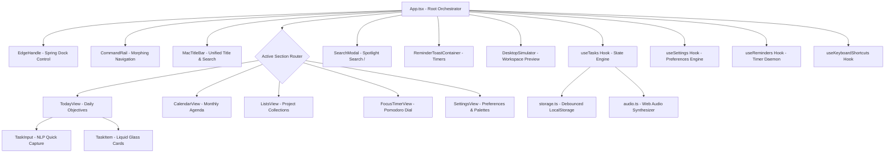
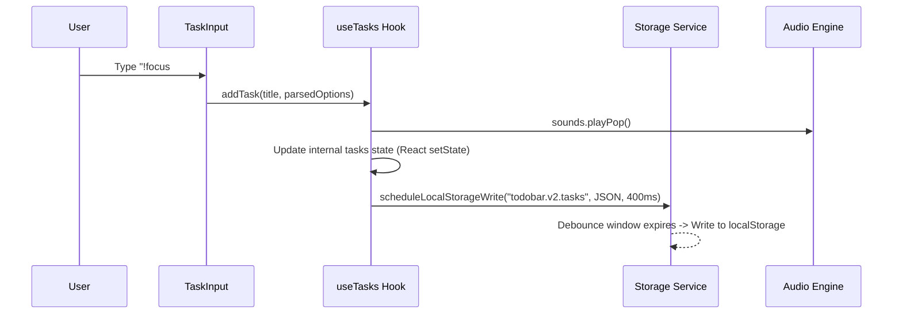

# 🏛️ Architecture & Technical Documentation — Todobar Pro

> **Todobar Pro** is a high-performance, dockable desktop productivity application crafted with **Apple's 2026 Liquid Glass Design System** (macOS 26 Tahoe / iPadOS 26 / VisionOS HIG), React 19, TypeScript, and Tailwind CSS v4.

---

## 📑 Table of Contents

1. [System Overview & Design Philosophy](#1-system-overview--design-philosophy)
2. [Component & Directory Architecture](#2-component--directory-architecture)
3. [Liquid Glass Material & Physics Engine](#3-liquid-glass-material--physics-engine)
4. [State Management & Data Flow](#4-state-management--data-flow)
5. [Storage & Debounced Persistence Engine](#5-storage--debounced-persistence-engine)
6. [Web Audio Synthesis Engine](#6-web-audio-synthesis-engine)
7. [Smart Natural Language Processing (NLP)](#7-smart-natural-language-processing-nlp)
8. [Keyboard Navigation & Shortcuts Matrix](#8-keyboard-navigation--shortcuts-matrix)
9. [Desktop & Packaging Pipeline](#9-desktop--packaging-pipeline)

---

## 1. System Overview & Design Philosophy

Todobar Pro is engineered to sit at the edge of the user's workspace as a non-intrusive, dockable sidebar that responds to drag gestures and global keyboard hotkeys (`Alt+T`).



### Core Tenets:
- **Zero Friction**: Add tasks in < 2 seconds via natural language tags (`!focus #work Submit draft`).
- **Apple HIG Liquid Glass Materials**: Multi-layer optical refraction, dynamic blur, specular highlights, and spring physics (`cubic-bezier(0.16, 1, 0.3, 1)`).
- **Offline-First & Durable**: Zero external database dependency; debounced local persistence with instant schema migrations.
- **Accessibility First**: WCAG 2.2 Level AAA contrast ratios, keyboard navigability, and ARIA role mappings.

---

## 2. Component & Directory Architecture

```
todobar-app/
├── public/                     # Static assets and icons
├── src/
│   ├── components/             # Liquid Glass UI Component Layer
│   │   ├── CalendarView.tsx    # Month grid & agenda planner
│   │   ├── CommandRail.tsx     # Sliding liquid glass capsule navigation rail
│   │   ├── DesktopSimulator.tsx# Realistic desktop wallpaper & window simulator
│   │   ├── EdgeHandle.tsx      # Draggable liquid glass edge dock handle
│   │   ├── FocusTimerView.tsx  # Circular SVG progress dial Pomodoro chamber
│   │   ├── LiquidGlassIcon.tsx # 3D refractive liquid glass icon glyph tiles
│   │   ├── ListsView.tsx       # Custom project collections with color tints
│   │   ├── MacTitleBar.tsx     # Native macOS traffic lights & search pill
│   │   ├── ReminderToastContainer.tsx # Sliding notification toasts
│   │   ├── SearchModal.tsx     # Spotlight global search overlay
│   │   ├── SettingsView.tsx    # Appearance, audio, density, backup controls
│   │   ├── TaskInput.tsx       # Quick capture bar with smart tag chips
│   │   ├── TaskItem.tsx        # Unified 3D liquid glass task item cards
│   │   └── TodayView.tsx       # Daily task hierarchy & segmented control
│   ├── constants/
│   │   └── themes.ts           # 12 Curated Liquid Glass theme presets
│   ├── hooks/
│   │   ├── useKeyboardShortcuts.ts # Hotkeys manager (Alt+T, ⌘1-4, /, N)
│   │   ├── useReminders.ts     # Active reminder polling daemon
│   │   ├── useSettings.ts      # User preferences and dock edge state
│   │   └── useTasks.ts         # Task and list CRUD mutations with debounced save
│   ├── services/
│   │   ├── audio.ts            # Native Web Audio API procedural sound engine
│   │   ├── exportImport.ts     # JSON data export, backup, and restore
│   │   └── storage.ts          # Safe localStorage read/write with debouncing
│   ├── types/
│   │   └── index.ts            # TypeScript interfaces & domain models
│   ├── App.tsx                 # Root application container & theme injection
│   ├── index.css               # Tailwind CSS v4 + Liquid Glass shader tokens
│   └── main.tsx                # React 19 root bootstrap
├── ARCHITECTURE.md             # This document
├── README.md                   # Project overview & quick start
├── package.json                # Dependencies & scripts
└── tsconfig.json               # TypeScript strict configuration
```

---

## 3. Liquid Glass Material & Physics Engine

Todobar Pro implements Apple's **macOS 26 / VisionOS Material Specification**:

### 3.1 Refraction & Blur Shader Stack (`src/index.css`)
```css
/* Liquid Glass Material Classes */
.liquid-glass-sidebar {
  background: var(--bg-sidebar) !important;
  backdrop-filter: blur(48px) saturate(220%) contrast(106%) !important;
  border: 1px solid var(--border-subtle) !important;
  box-shadow: 
    inset 0 1.5px 1px 0 rgba(255, 255, 255, 0.35),
    inset 0 0 0 1px rgba(255, 255, 255, 0.08),
    inset 0 -1px 1px 0 rgba(0, 0, 0, 0.2),
    0 30px 70px -15px rgba(0, 0, 0, 0.6),
    0 0 40px 0 var(--glow-color) !important;
}

.liquid-glass-card {
  background: var(--bg-card) !important;
  backdrop-filter: blur(28px) saturate(190%) !important;
  border: 1px solid var(--border-subtle) !important;
  box-shadow: 
    inset 0 1px 1px 0 rgba(255, 255, 255, 0.25),
    0 8px 24px -4px rgba(0, 0, 0, 0.35) !important;
  transition: all 220ms cubic-bezier(0.16, 1, 0.3, 1);
}
```

### 3.2 Spring Physics Curve
Every translation and morphing element (sidebar edge slide, navigation capsule glide, segmented picker highlight) uses Apple's native spring timing curve:
$$\text{cubic-bezier}(0.16, 1.0, 0.3, 1.0) \quad (\text{Duration: } 360\text{ms})$$

---

## 4. State Management & Data Flow



### Core Domain Models (`src/types/index.ts`):
- **`Task`**: Unique ID, Title, Description, Priority (`focus` | `normal` | `later`), List ID, Due Date, Due Time, Reminder ISO, Estimated Minutes, Tags array, Subtasks checklist array, CreatedAt, CompletedAt.
- **`CustomList`**: ID, Title, Color hex, Icon identifier, PinToToday flag, CreatedAt.
- **`AppSettings`**: DockEdge (`right` | `left` | `top` | `floating`), PanelWidth (320px–640px), VisualStyle (12 presets), Soundscape toggles, Density (`compact` | `normal` | `spacious`).

---

## 5. Storage & Debounced Persistence Engine

The storage engine (`src/services/storage.ts`) prevents I/O locking by debouncing writes through an in-memory queue:

```typescript
const writeQueues = new Map<string, number>()

export function scheduleLocalStorageWrite(key: string, value: string, delayMs = 400): () => void {
  const existingTimer = writeQueues.get(key)
  if (existingTimer) clearTimeout(existingTimer)

  const timer = window.setTimeout(() => {
    try {
      localStorage.setItem(key, value)
    } catch (e) {
      console.error('Storage write error:', e)
    } finally {
      writeQueues.delete(key)
    }
  }, delayMs)

  writeQueues.set(key, timer)
  return () => clearTimeout(timer)
}
```

---

## 6. Web Audio Synthesis Engine

Todobar Pro generates tactile UI feedback using the **HTML5 Web Audio API** without relying on heavy external `.mp3` or `.wav` files (`src/services/audio.ts`):

- **Click Feedback**: Short 800Hz sine burst with 40ms exponential decay.
- **Completion Chime**: 2-tone melodic harmonic arpeggio (587.33Hz $\rightarrow$ 880.00Hz) with smooth reverb release.
- **Timer Alert**: 3-pulse 1046.5Hz triangle wave sequence signaling Pomodoro completion.

---

## 7. Smart Natural Language Processing (NLP)

When capturing tasks via `TaskInput.tsx`, the inline NLP parser automatically detects:
- **Priority Prefixes**: `!focus`, `!high` $\rightarrow$ sets `priority: 'focus'`; `!later`, `!low` $\rightarrow$ sets `priority: 'later'`.
- **Hashtag Categorization**: `#design`, `#marketing` $\rightarrow$ automatically added to `task.tags`.
- **Auto-stripping**: Removes command syntax from title for clean visual rendering.

---

## 8. Keyboard Navigation & Shortcuts Matrix

| Hotkey | Context | Action |
| :--- | :--- | :--- |
| <kbd>Alt</kbd> + <kbd>T</kbd> | Global | Toggle Dockable Sidebar (Expand / Retract) |
| <kbd>Esc</kbd> | Global | Retract Sidebar / Close Active Modal |
| <kbd>/</kbd> or <kbd>⌘</kbd> + <kbd>/</kbd> | Global | Open Global Spotlight Search |
| <kbd>N</kbd> | Main View | Focus Quick Task Capture Input |
| <kbd>⌘</kbd> + <kbd>1</kbd> | Global | Switch to Today's Objectives |
| <kbd>⌘</kbd> + <kbd>2</kbd> | Global | Switch to Calendar Agenda |
| <kbd>⌘</kbd> + <kbd>3</kbd> | Global | Switch to Project Collections |
| <kbd>⌘</kbd> + <kbd>4</kbd> | Global | Switch to Focus Chamber (Pomodoro) |
| <kbd>⌘</kbd> + <kbd>,</kbd> | Global | Open Preferences & Theme Customizer |
| <kbd>Enter</kbd> | Task Capture | Save and add task with natural tags |

---

## 9. Desktop & Packaging Pipeline

Todobar Pro is architected for instant deployment across web and native desktop wrappers:

### Web / PWA Build:
```bash
npm run build      # Produces optimized static assets in /dist
npm run preview    # Preview production bundle locally
```

### Tauri Desktop Wrapper Readiness:
```bash
# Add Tauri CLI (optional for native .msi / .dmg / .deb binary generation)
npm install -D @tauri-apps/cli
npx tauri init
```

---

## 📄 License
MIT © Roshan & Todobar Contributors
