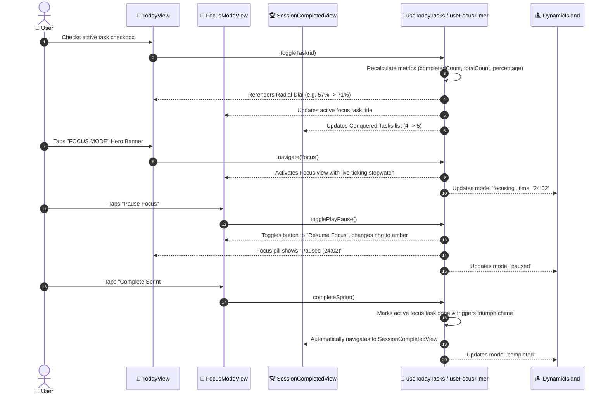
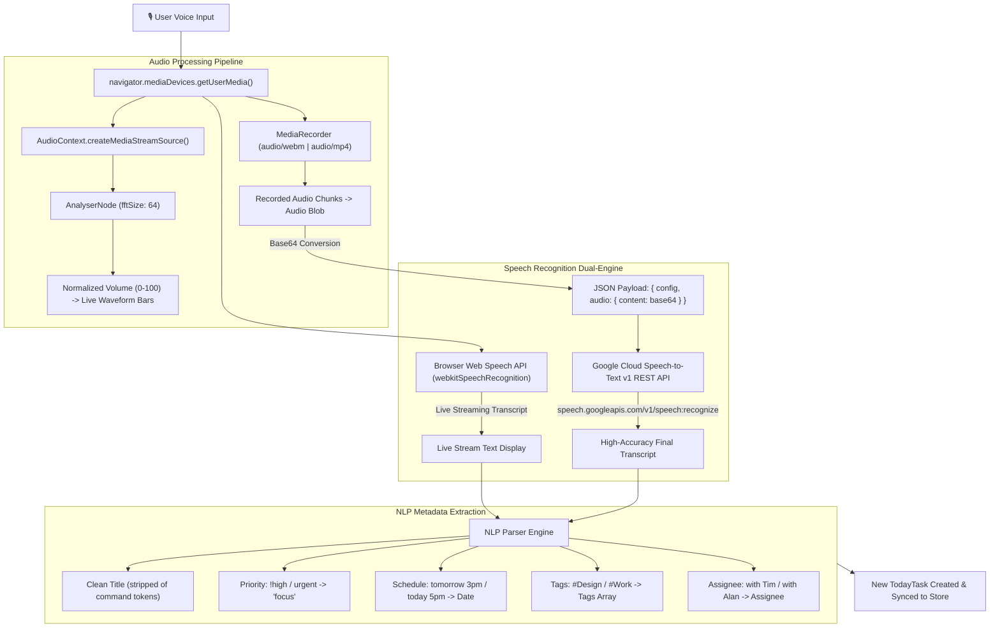
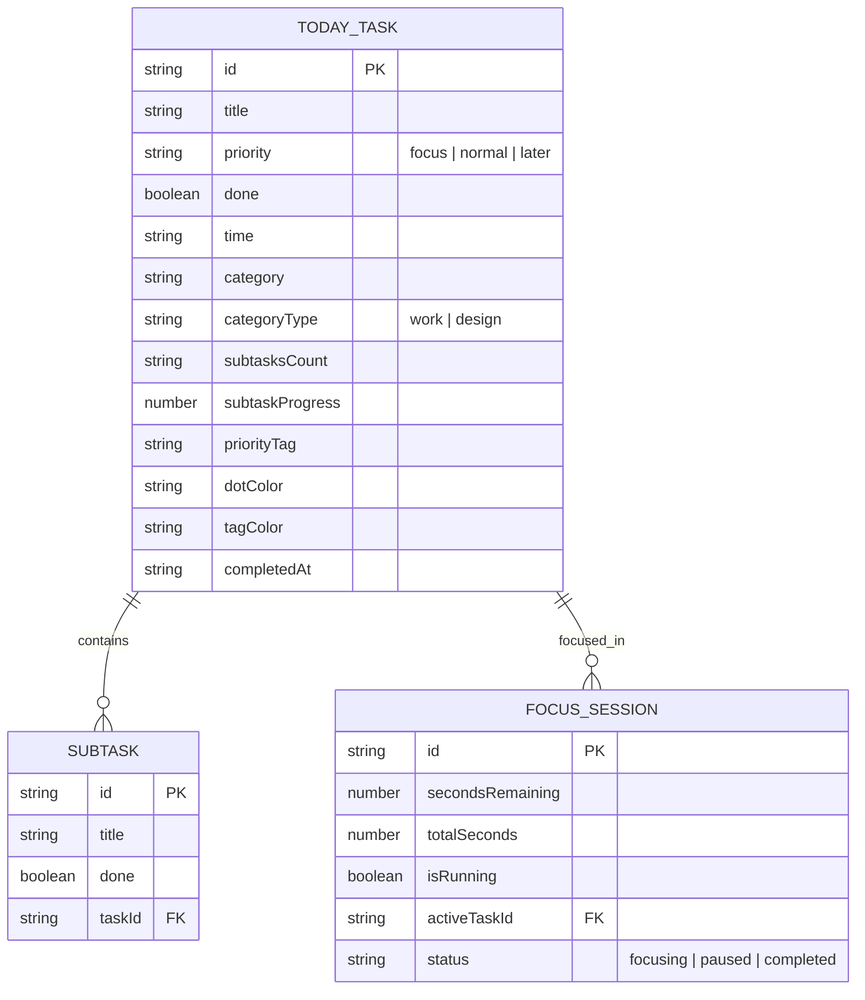

# 🏛️ System Architecture — Todobar Pro (Liquid Glass Edition)

> **Todobar Pro** is a modern, high-performance, mobile-first productivity application featuring **Apple's 2026 Liquid Glass Design System** (iOS 26 / VisionOS HIG), React 19, TypeScript, Tailwind CSS v4, procedural Web Audio, and a dual-engine Speech-to-Text pipeline powered by **Google Cloud Speech-to-Text API** and **Web Speech API**.

---

## 📑 Table of Contents

1. [🏗️ System Architecture Topology](#1-️-system-architecture-topology)
2. [Component & Directory Structure](#2-component--directory-structure)
3. [Tri-Core Tab Synchronization Engine](#3-tri-core-tab-synchronization-engine)
4. [🎙️ Dual-Engine Speech-to-Text & NLP Architecture](#4-️-dual-engine-speech-to-text--nlp-architecture)
5. [⏱️ Centralized Focus Stopwatch Engine](#5-️-centralized-focus-stopwatch-engine)
6. [🗄️ Domain Model & Entity Relationship Diagram (ERD)](#6-️-domain-model--entity-relationship-diagram-erd)
7. [Liquid Glass Optical Shading Stack](#7-liquid-glass-optical-shading-stack)
8. [Deployment & CI/CD Pipeline](#8-deployment--cicd-pipeline)

---

## 1. 🏗️ System Architecture Topology

Todobar Pro is architected as an offline-first, reactive single-page application with cross-tab synchronized state, procedural audio synthesis, and cloud API fallbacks.

```mermaid
graph TB
    subgraph Viewport_Layer ["📱 Viewport & Frame Layer"]
        IPhoneFrame["IPhone16ProMaxFrame (Chassis Simulator / Native Full-Bleed)"]
        DynamicIsland["DynamicIsland (Status: Focusing | Paused | Completed)"]
        TodobarDock["TodobarDock (Persistent Floating Glass Capsule)"]
    end

    subgraph Primary_Views ["🖥️ Tri-Core Primary Screens"]
        TodayView["TodayView (Dial, Filters, Priority Focus, Completed Today)"]
        FocusModeView["FocusModeView (Stopwatch Dial, Pause/Resume, Soundscape)"]
        SessionCompletedView["SessionCompletedView (Done Telemetry & Conquered Tasks)"]
    end

    subgraph Secondary_Views ["🪟 Modals & Ancillary Screens"]
        QuickAddModal["QuickAddModal (Speech Dictation, NLP, Smart Schedule)"]
        MiniBreakModal["MiniBreakModal (Sprint Suspension & Respiration)"]
        GlobalSearchModal["GlobalSearchModal (Spotlight Omnibox)"]
        CalendarTimelineView["CalendarTimelineView (Schedule & Timeblocks)"]
        AccountProfileView["AccountProfileView (Flow Telemetry & Profile)"]
    end

    subgraph Reactive_State_Engine ["🧠 Centralized State & Timer Engine (App.tsx)"]
        useTodayTasks["useTodayTasks (Reactive Task Store & Dynamic Math)"]
        useFocusTimer["useFocusTimer (Persistent Real-Time Stopwatch)"]
        useTasks["useTasks (Legacy Task Collections & Filters)"]
    end

    subgraph Speech_And_Audio_Subsystem ["🎙️ Speech & Procedural Audio Engine"]
        GoogleCloudSTT["Google Cloud Speech-to-Text v1 REST API (speech.googleapis.com)"]
        WebSpeechAPI["Browser Web Speech API (webkitSpeechRecognition)"]
        WebAudioAnalyser["Web Audio AnalyserNode (Reactive Waveform Visualizer)"]
        SoundEngine["Procedural Sound Engine (Web Audio Sine/Triangle Chimes)"]
        NLPParser["NLP Task Parser (Priority, Dates, Tags, Assignee)"]
    end

    subgraph Persistence_Layer ["💾 Storage & Cache Engine"]
        LocalStorage[("HTML5 LocalStorage (v4 Namespaced Key-Value Store)")]
    end

    %% Bindings
    IPhoneFrame --> DynamicIsland
    IPhoneFrame --> Primary_Views
    IPhoneFrame --> Secondary_Views
    IPhoneFrame --> TodobarDock

    TodobarDock -->|Tab Select| Primary_Views
    TodobarDock -->|Quick Add Trigger| QuickAddModal

    TodayView <--> useTodayTasks
    TodayView <--> useFocusTimer
    FocusModeView <--> useFocusTimer
    FocusModeView <--> useTodayTasks
    SessionCompletedView <--> useTodayTasks
    SessionCompletedView <--> useFocusTimer

    QuickAddModal -->|Voice Stream| WebSpeechAPI
    QuickAddModal -->|Audio Blob| GoogleCloudSTT
    QuickAddModal -->|Microphone Stream| WebAudioAnalyser
    QuickAddModal -->|Raw Text| NLPParser
    QuickAddModal -->|Dispatch Task| useTodayTasks

    useTodayTasks -->|Sync Writes| LocalStorage
    useTodayTasks -->|Haptic Feedback| SoundEngine
    useFocusTimer -->|State Sync| DynamicIsland
    useFocusTimer -->|Sprint Triumph| SoundEngine
```



---

## 2. Component & Directory Structure

```
todobar-app/
├── public/                     # Static assets, icons, and Apple web app manifests
├── src/
│   ├── components/             # Liquid Glass UI Presentation Components
│   │   ├── AccountProfileView.tsx     # Flow state statistics and account settings
│   │   ├── CalendarTimelineView.tsx   # Agenda timeblock grid and date navigator
│   │   ├── DynamicIsland.tsx          # Emulated Dynamic Island with interactive modes
│   │   ├── FocusModeView.tsx          # Real-time circular countdown stopwatch & controls
│   │   ├── GlobalSearchModal.tsx      # Spotlight-style search modal with keyboard navigation
│   │   ├── IPhone16ProMaxFrame.tsx    # Titanium frame chassis with responsive viewport toggle
│   │   ├── MiniBreakModal.tsx         # Guided micro-break and respiration overlay
│   │   ├── QuickAddModal.tsx          # Voice dictation modal with reactive waveform & NLP
│   │   ├── SessionCompletedView.tsx   # Conquered sprint telemetry & synced completed tasks
│   │   ├── TodayView.tsx              # Dynamic dial, category filter chips, and task lists
│   │   └── TodobarDock.tsx            # Floating glass capsule dock with active glow tabs
│   ├── hooks/
│   │   ├── useFocusTimer.ts           # Centralized countdown timer with real-time interval
│   │   ├── useTodayTasks.ts           # Unified reactive store for Today tasks, math & categories
│   │   └── useTasks.ts                # Legacy collections and list filtering hook
│   ├── services/
│   │   ├── audio.ts                   # Procedural Web Audio API sound synthesizer
│   │   ├── speechToText.ts            # Dual-engine Google Cloud Speech + Web Speech service
│   │   └── storage.ts                 # Safe debounced localStorage utility
│   ├── utils/
│   │   └── nlpParser.ts               # Regex/NLP engine extracting dates, priorities, tags
│   ├── types/
│   │   └── index.ts                   # Domain models (TodayTask, Task, IslandMode, etc.)
│   ├── App.tsx                        # Core state hub, view routing & hardware frame binding
│   ├── index.css                      # Tailwind v4 theme, custom animations & glass shaders
│   └── main.tsx                       # React 19 root bootstrap
├── .env                               # Environment configurations (Google Cloud STT Key)
├── ARCHITECTURE.md                    # Technical architecture specification
├── DOCUMENTATION.md                   # Comprehensive feature & developer guide
├── package.json                       # Project dependencies & build scripts
├── vite.config.ts                     # Vite build & bundler configuration
└── tsconfig.json                      # Strict TypeScript compiler options
```

---

## 3. Tri-Core Tab Synchronization Engine

All 3 primary tabs (`Today`, `Focus`, `Done`) share a single, unified state model in `App.tsx`:



### 3.1 Dynamic Radial Completion Dial Math
The radial completion progress is mathematically bound to live task status:
$$\text{totalCount} = |\mathcal{T}|$$
$$\text{completedCount} = |\{t \in \mathcal{T} : t.\text{done} = \text{true}\}|$$
$$\text{completionPercentage} = \begin{cases} \text{round}\left(\frac{\text{completedCount}}{\text{totalCount}} \times 100\right), & \text{totalCount} > 0 \\ 0, & \text{totalCount} = 0 \end{cases}$$
$$\text{SVG Stroke Dashoffset} = 2 \pi r \times \left(1 - \frac{\text{completionPercentage}}{100}\right) \quad (r = 28\text{px})$$
$$\text{leftTodayCount} = \max(0, \text{totalCount} - \text{completedCount})$$

### 3.2 Category Determination (`WORK` vs `DESIGN SYSTEM`)
Filter chips dynamically segment tasks without hardcoded arrays:
* **`DESIGN SYSTEM`**: Tasks flagged with `categoryType: 'design'` or keywords matching Figma, Design Tokens, Liquid Glass specs, or SwiftUI components.
* **`WORK`**: Tasks flagged with `categoryType: 'work'` or keywords matching engineering sprints, haptics, pitch decks, Keynote reviews, standups, or team meetings.
* **`ALL TASKS`**: Union of all active and completed tasks.
* **Interactive Filtering**: Selecting any chip filters the active Priority Focus list and Completed Today accordion simultaneously.

---

## 4. 🎙️ Dual-Engine Speech-to-Text & NLP Architecture



---

## 5. ⏱️ Centralized Focus Stopwatch Engine

The focus countdown timer lives globally in `useFocusTimer.ts` so navigation between tabs does not reset or pause the user's active sprint:

| Action | Handler | Effect |
| :--- | :--- | :--- |
| **Tick (1s)** | `setInterval` in hook | Decrements `secondsRemaining`, updates circular SVG offset, updates Today banner and Dynamic Island |
| **Play / Pause** | `togglePlayPause()` | Toggles `isRunning`, changes CTA to Pause or Resume with liquid color transitions, updates Dynamic Island mode |
| **Adjust (-5m / +5m)** | `adjust(deltaMinutes)` | Adds/subtracts 300 seconds, clamped between 60s and 5400s (90m) |
| **Reset** | `reset()` | Reverts timer to `totalSeconds` (45:00 default) and sets `isRunning: false` |
| **Complete Sprint** | `complete()` | Marks sprint done, plays triumph chime, navigates to `SessionCompletedView` |

---

## 6. 🗄️ Domain Model & Entity Relationship Diagram (ERD)



---

## 7. Liquid Glass Optical Shading Stack

```css
/* Multi-Layer Refractive Shading Specification */
.liquid-glass-chassis {
  background: rgba(12, 13, 24, 0.95);
  backdrop-filter: blur(48px) saturate(220%) contrast(106%);
  border: 1px solid rgba(255, 255, 255, 0.18);
  box-shadow: 
    inset 0 1.5px 1px 0 rgba(255, 255, 255, 0.35),
    inset 0 0 0 1px rgba(255, 255, 255, 0.08),
    0 30px 90px rgba(0, 0, 0, 0.9),
    0 0 40px rgba(0, 240, 255, 0.15);
}

.liquid-glass-interactive-card {
  background: linear-gradient(135deg, rgba(255, 255, 255, 0.08), rgba(255, 255, 255, 0.03));
  backdrop-filter: blur(28px) saturate(190%);
  border: 1px solid rgba(255, 255, 255, 0.18);
  box-shadow: 
    inset 0 1px 0 rgba(255, 255, 255, 0.2),
    0 8px 32px rgba(0, 0, 0, 0.45);
  transition: all 300ms cubic-bezier(0.16, 1, 0.3, 1);
}
```

---

## 8. Deployment & CI/CD Pipeline

* **Repository**: [`https://github.com/roshan-pixel/TODOBAR----DSKTOP----NPM`](https://github.com/roshan-pixel/TODOBAR----DSKTOP----NPM)
* **Production Deployment**: Hosted on [Render](https://render.com) at [`https://todobar-pro.onrender.com`](https://todobar-pro.onrender.com).
* **Continuous Deployment**: Auto-builds and deploys from `main` branch upon every git push via Vite production build (`dist/`).
